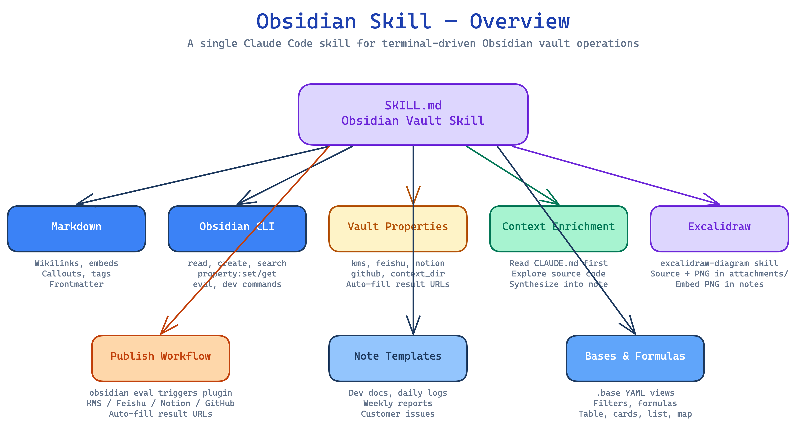
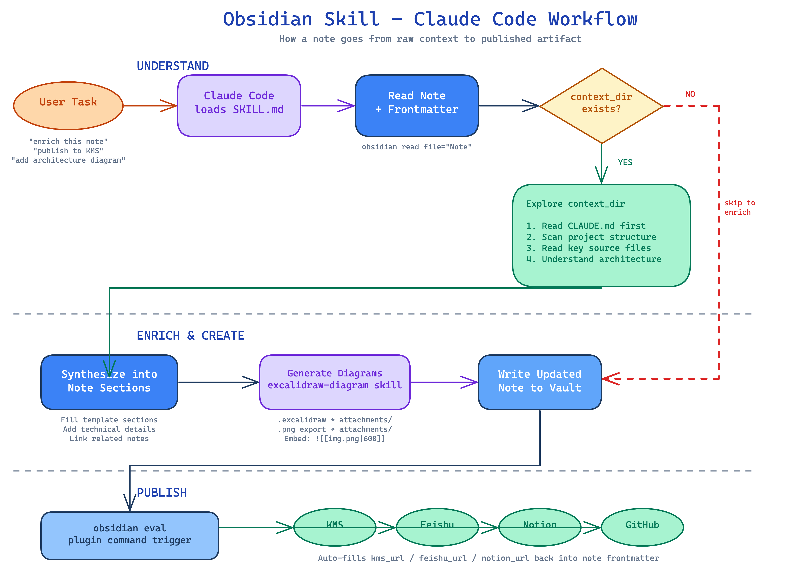

# Obsidian Skill

A Claude Code skill for operating an Obsidian vault from the terminal. Enables note creation, context-driven enrichment, diagram generation, and multi-platform publishing.

## Skill Overview



## Claude Code Workflow



## What This Skill Does

- **Read & write notes** using Obsidian Flavored Markdown with wikilinks, embeds, callouts
- **Enrich notes from context** — read `context_dir` source material and synthesize into notes
- **Generate diagrams** — Excalidraw source files kept in `attachments/` for future edits, PNG exports embedded in notes
- **Manage properties** — custom frontmatter system for publish targets, context links
- **Publish** — trigger `obsidian-publish-everywhere` plugin via CLI to publish to KMS, Feishu, Notion, GitHub
- **Use templates** — create notes from vault templates (dev docs, daily logs, etc.)
- **Query the vault** — search, list tags, find backlinks via `obsidian` CLI

## Prerequisites

- Obsidian running with the vault open
- `obsidian` CLI available (bundled with Obsidian desktop app)
- `obsidian-publish-everywhere` plugin installed (for publishing features)

## Structure

```
SKILL.md                              # Root skill definition
references/
├── obsidian-markdown.md              # Markdown syntax reference
├── obsidian-cli.md                   # CLI command reference
├── vault-properties.md               # Custom property system
├── publish-workflow.md               # Multi-platform publishing
├── context-enrichment.md             # context_dir enrichment workflow
├── excalidraw.md                     # Diagram generation
├── note-templates.md                 # Vault templates
├── callouts.md                       # Callout types
├── embeds.md                         # Embed syntax
└── bases-formulas.md                 # Bases & formula functions
```

## Installation

Copy this directory into your Claude Code skills path, or place it alongside your vault's `.claude` configuration.
