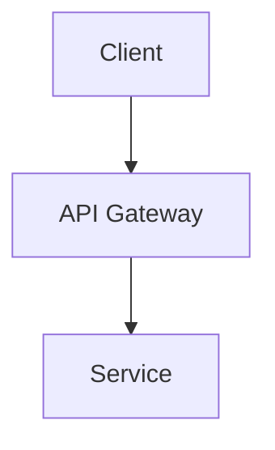

# Context Enrichment

The core workflow for Claude Code to enrich notes using source material from `context_dir`.

## Philosophy

Notes are **information-condensed products**. The `context_dir` property points to a local directory containing the full source material — code, detailed documentation, architecture references. Claude reads this directory to understand the complete picture, then synthesizes the essential information into the note.

> **CRITICAL**: When a note has a `context_dir` property, this directory is the **primary information source** for that note. You MUST explore it before writing, editing, or enriching the note. Without reading the context directory, you lack the foundation to produce accurate, grounded content. Never skip this step — it is the difference between a surface-level summary and a note that reflects real understanding.

## Workflow

### 1. Read the Note & Check for `context_dir`

```bash
obsidian read file="My Note"
obsidian property:get name="context_dir" file="My Note"
```

Read the note to understand its current structure. **If `context_dir` exists, you MUST explore it before any editing.**

### 2. Explore `context_dir` (Mandatory When Present)

The `context_dir` is not optional context — it is the **ground truth** that the note distills. Skipping it means writing without foundation.

Explore the directory thoroughly:
- **Read `CLAUDE.md` first** — if a `CLAUDE.md` exists in `context_dir`, read it immediately. This file contains project-level instructions, architecture overview, and key context that accelerates understanding. It is the fastest path to the big picture.
- **Scan structure** — understand the project layout, modules, packages
- **Read key source files** — entry points, core logic, configuration
- **Understand architecture** — component relationships, data flows, interfaces
- **Identify design decisions** — why things are built this way, trade-offs
- **Note recent changes** — TODOs, known issues, active development areas
- **Read existing docs** — README, inline comments, API docs

Use the Explore agent for broad exploration, or direct file reads for targeted investigation. The depth of exploration should match the note's scope — a module-level note needs the full module scanned.

### 3. Enrich the Note

Fill in missing sections based on the source material:
- **Background/context** — explain the problem being solved
- **Technical details** — describe architecture, key components, data structures
- **Design decisions** — capture the "why" behind choices
- **Implementation notes** — highlight non-obvious logic, edge cases
- **Diagrams** — generate architecture, flow, or sequence diagrams

### 4. Generate Diagrams

Based on the source material, create visual representations:
- **Architecture diagrams** — component relationships, system boundaries
- **Flow diagrams** — request paths, data processing pipelines
- **Sequence diagrams** — interaction between services/modules

Use Mermaid for simple diagrams (inline in the note) or Excalidraw for complex visual diagrams. See [excalidraw.md](excalidraw.md).

### 5. Embed Results

```markdown
![[Architecture Diagram.excalidraw]]


```

## Rules

1. **Synthesize, don't dump** — Notes are condensed. Extract the essence from source material. Don't copy-paste raw code into notes.

2. **Respect existing structure** — If the note follows a template (e.g., dev doc template), fill in the template sections. Don't restructure unless asked.

3. **Match the language** — Work notes are typically in Chinese. Follow the existing note's language.

4. **Place attachments correctly** — All images and diagram PNGs go in the note's local `attachments/` folder. No `.excalidraw` source files are kept — regenerate from scratch when updates are needed.

5. **Use templates** — When creating new notes, use the appropriate template from `Work/Templates/`. See [note-templates.md](note-templates.md).

6. **Link related notes** — Use `[[wikilinks]]` to connect to related notes in the vault.

7. **Update, don't duplicate** — If information already exists in the note, update it rather than adding a duplicate section.

## Example

Given a note about a tool registry system with `context_dir: /Users/anner/fine/ai`:

1. Explore `/Users/anner/fine/ai` — find the tool registry code, understand the architecture
2. Read the note — see template sections like "问题现状", "设计目标", "详细设计"
3. Fill in:
   - Current state of the tool registry (from code analysis)
   - Identified problems (from TODOs, code smells)
   - Proposed design (from PRDs, recent commits)
   - Architecture diagram (from component relationships)
4. Embed a Mermaid or Excalidraw diagram showing the tool/skill/agent extension architecture
