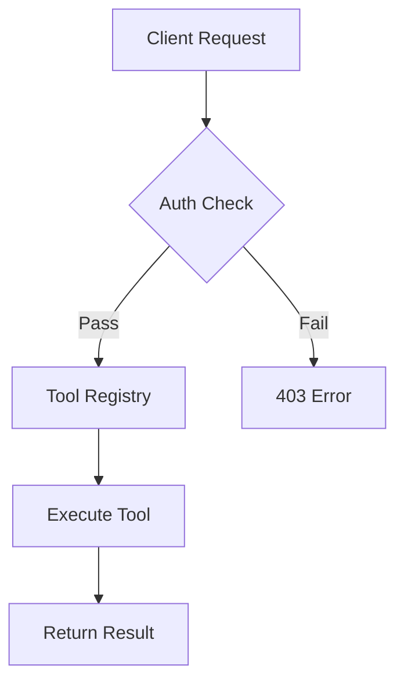
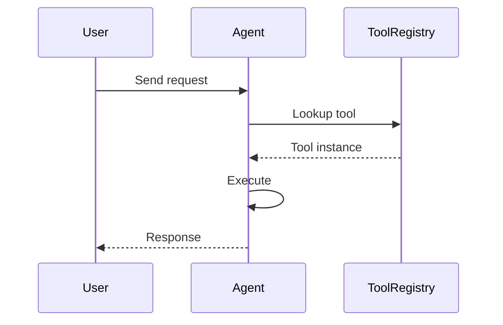

# Excalidraw Diagrams

Generate diagrams and embed them as PNG images in Obsidian notes.

> **Key rule**: Only PNG images are stored and embedded. No `.excalidraw` source files are kept. Every time a diagram needs updating, regenerate it from scratch and overwrite the existing PNG.

## Location & Naming

PNG images go in the note's local `attachments/` folder:

```
Work/Fine AI/Moss/开发文档/
├── 20260409 Moss 工具扩展体系.md          # The note
└── attachments/
    └── tool-registry-arch.png             # Diagram image (embedded in note)
```

**Naming**: Use descriptive kebab-case names that match the diagram's purpose (e.g., `tool-registry-arch`, `data-flow-overview`). Avoid timestamps.

## Embedding

```markdown
![[attachments/tool-registry-arch.png|600]]
```

Use the `|600` width suffix for consistent sizing.

## When to Use Excalidraw vs Mermaid

| Use Case | Tool | Reason |
|----------|------|--------|
| Simple flowcharts | Mermaid | Inline, no extra file |
| Sequence diagrams | Mermaid | Text-based, easy to maintain |
| Architecture diagrams | Excalidraw | Freeform layout, visual polish |
| System overviews | Excalidraw | Complex relationships, custom positioning |
| Quick decision trees | Mermaid | Fast, readable in source |
| Detailed component maps | Excalidraw | Spatial arrangement matters |

## Mermaid (Inline Alternative)

For simple diagrams, use Mermaid code blocks directly in the note:

````markdown

````

````markdown

````

## Creating Diagrams — Use `excalidraw-diagram` Skill

**Always use the local `excalidraw-diagram` skill first** (installed at `~/.claude/skills/excalidraw-diagram-skill/`). This skill generates `.excalidraw` JSON with proper visual design — "diagrams should argue, not display" philosophy with branded color palettes.

### Workflow

1. **Generate the `.excalidraw` JSON** using the `excalidraw-diagram` skill (as a temporary file). It handles:
   - Shape semantics (shape IS meaning)
   - Color palette from `references/color-palette.md`
   - Element templates from `references/element-templates.md`
   - Proper layout, grouping, and visual hierarchy
2. **Render to PNG** using the skill's render script
3. **Save the PNG only** to the note's `attachments/` folder: `attachments/<name>.png`
4. **Delete the temporary `.excalidraw` file** — do not keep it
5. **Embed the PNG** in the note: `![[attachments/<name>.png|600]]`

### Skill Reference

The skill's key references (at `~/.claude/skills/excalidraw-diagram-skill/references/`):
- `json-schema.md` — Excalidraw JSON structure
- `element-templates.md` — Reusable element patterns
- `color-palette.md` — Brand colors (edit this to customize)

### Fallback

If the `excalidraw-diagram` skill is unavailable, create diagrams in Obsidian's Excalidraw plugin and export as PNG to `attachments/`.

## Update Workflow

When a diagram needs changes:

1. **Regenerate from scratch** — use the `excalidraw-diagram` skill to create a new `.excalidraw` temp file
2. **Render to PNG** — overwrite `attachments/<name>.png` with the new export
3. **Clean up** — delete the temp `.excalidraw` file
4. **Note stays current** — the embed `![[attachments/<name>.png|600]]` points to the same path

Every diagram is disposable and reproducible. No source files to maintain.

## Publishing

The `obsidian-publish-everywhere` plugin handles image uploads automatically. Since notes embed PNGs, published pages show diagrams correctly on all platforms (KMS, Feishu, Notion, GitHub).
